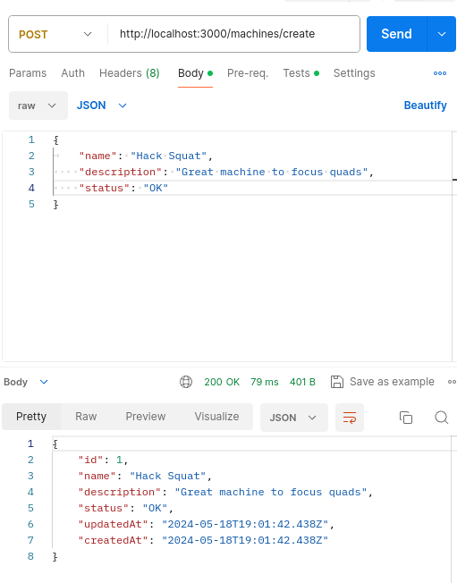
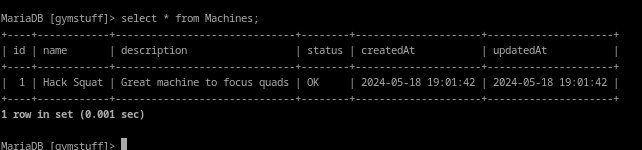
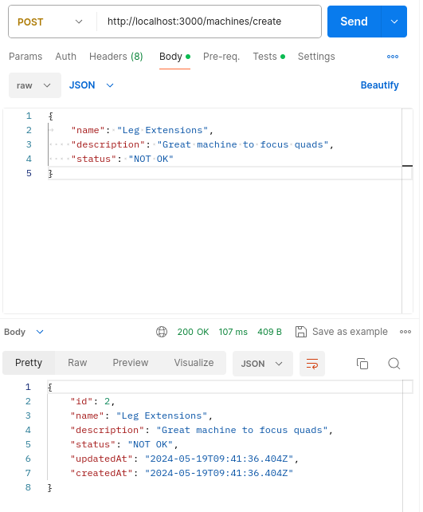
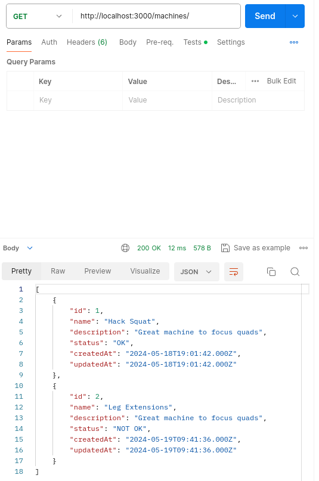
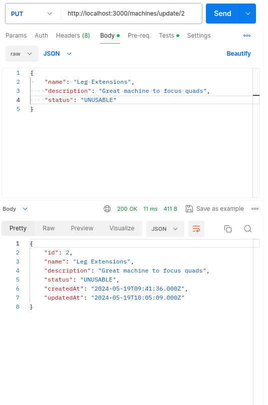
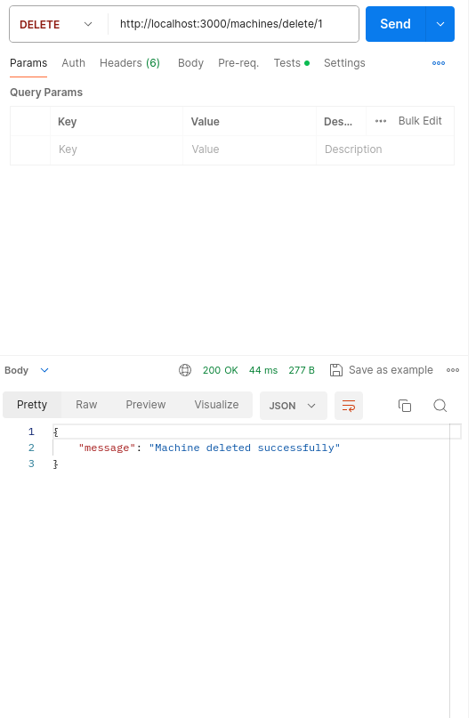
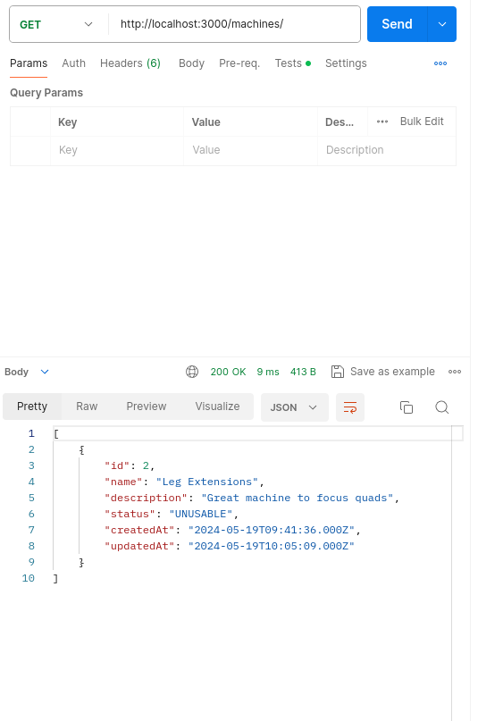

# Create Basic API Restful Express.js
Basic API Restful with Express.js that manages members and machines from gym

## ER Model


## Creating the project

### Startup
```bash
npm init -y
```

Add the following line at package.json

```bash
"start": "nodemon server.js"
```

Your package.json should look like this
```json
"scripts": {
    "test": "echo \"Error: no test specified\" && exit 1",
    "start": "nodemon server.js"
  },
```

Install the following packages
```bash
npm i express sequelize-cli sequelize bcrypt nodemon express-session
```
```bash
npm install mysql2 --save
```

### Create your first express application
Create server.js file

This is a minimal expressjs application with /ping get method route

```js
const express = require('express')

const app = express()

app.get('/ping', (req, res) => {
    res.send('pong')
})

app.listen(3000, () => {
    console.log('Server is running on port 3000')
})
```

Go to the http://localhost:3000/ping
You should see 'pong' on the page

## Setup Database Connection
```bash
npx sequelize-cli init
```

Go to mysql and create a database

```sql
CREATE DATABASE gymstuff
```

At config/config.json, put your credentials and name of the database
It should look like this

```json
"development": {
    "username": "root",
    "password": "rot",
    "database": "gymstuff",
    "host": "127.0.0.1",
    "dialect": "mysql"
}
```

## Creating the Machine Model (and Migratin)
```bash
npx sequelize-cli model:generate --name Machine --attributes name:string,description:string,status:string
```

You should see an similiar output
```bash
New model was created at api-restful-gym-stuff/models/machine.js .
New migration was created at api-restful-gym-stuff/migrations/20240518181311-create-machine.js .
```

## Running Migrations
```bash
npx sequelize-cli db:migrate
```

If you go to mysql, you should see that the tables were created

```bash
MariaDB [gymstuff]> show tables;
+--------------------+
| Tables_in_gymstuff |
+--------------------+
| Machines           |
| SequelizeMeta      |
+--------------------+
2 rows in set (0.001 sec)
```

## API Machine
Create routes and controllers folder
Create a new file at routes/machines.js

Set a simple post method to create a machine

```js
var express = require('express');
var router = express.Router();

const machineController = require('../controllers/machine')

router.post('/create', machineController.create);

module.exports = router
```

Create a new file at controllers/machine.js
This is a function that creates a machine from request body.

```js
const models = require('../models');
const Machine = models.Machine

const create = async(req, res) => {
    const data = req.body;
    const machine = await Machine.create(data);
    res.json(machine);
}

module.exports = {
    create
}
```

Update your server.js to use json parser middleware and set up the machine routes

```js
const machinesRouter = require('./routes/machines')
app.use(express.json())
app.use('/machines', machinesRouter);
```

Your server.js should look like this
```js
const express = require('express')
const machinesRouter = require('./routes/machines')

const app = express()

app.use(express.json())
app.use('/machines', machinesRouter);

app.get('/ping', (req, res) => {
    res.send('pong')
})

app.listen(3000, () => {
    console.log('Server is running on port 3000')
})
```

You can test API with Postman
So we try to insert a machine with some data with json


If we check at our database, you will see the row that we added


Add the following function at controllers/machine.js to see all machines
```js
const view = async(req, res) => {
    const machines = await Machine.findAll();
    res.json(machines);
}
```

controllers/machine.js
```js
const models = require('../models');
const Machine = models.Machine

const create = async(req, res) => {
    const data = req.body;
    const machine = await Machine.create(data);
    res.json(machine);
}

const view = async(req, res) => {
    const machines = await Machine.findAll();
    res.json(machines);
}

module.exports = {
    create,
    view
}
```
  
We created another machine  


If we test it at postman, you will see all machines



Add the following update function at controllers/machine.js
```js
const update = async(req, res) => {
    const data = req.body;
    await Machine.update({
        name: data.name,
        description: data.description,
        status: data.status
    }, {where: {id: req.params.id}})
    const machine_updated = await Machine.findOne({where: {id: req.params.id}})
    res.json(machine_updated);
}
```

Dont forget to add the function at module.exports
```js
module.exports = {
    create,
    view,
    update
}
```

At routes/machines.js add the following line, :id its a parameter that needs to be included to be able to update a specific machine
```js
router.put('/update/:id', machineController.update);
```

We updated the status of the machine with id 2


Add the following function to delete a machine
```js
const deleteMachine = async(req, res) => {
    await Machine.destroy({
        where: {
            id: req.params.id
        }
    })
    res.json({message: 'Machine deleted successfully'});
}
```

Add this route
```js
router.delete('/delete/:id', machineController.deleteMachine)
```
We deleted the machine with id 1


We can't see the machine with id 1
  
Now we have a full CRUD API for machines
